# 2. Arquitectura y Tecnología

El sistema **MaxiConecta Marketplace y Ventas** está diseñado bajo una **arquitectura de microservicios desacoplada**, coherente con el enfoque distribuido del ERP corporativo. Cada sistema del ecosistema (Inventarios, Pagos, Entregas, CRM, Contabilidad, etc.) es desarrollado y desplegado de forma independiente por su respectivo grupo y se comunica mediante contratos de API bien definidos.

---

## 2.a Diagrama General de Arquitectura

```mermaid
graph TD
    subgraph CapaPresentacion["Capa de Presentación (Frontend - Vue 3 + TS)"]
        UI_Marketplace["Marketplace Digital (Web / Cliente)"]
        UI_POS["Aplicación POS (Puntos de Venta)"]
        UI_Admin["Panel Administrativo / Gerencial"]
    end

    subgraph Gateway["Seguridad y Ruteo"]
        APIGateway["API Gateway (FastAPI)<br/>- Enrutamiento Dinámico<br/>- Validación JWT Supabase<br/>- Control de Acceso RBAC"]
    end

    subgraph CapaNegocio["Capa de Negocio (Microservicios FastAPI)"]
        MS_Catalogo["MS Catálogo y Precios"]
        MS_POS["MS Punto de Venta"]
        MS_Carrito["MS Carrito y Checkout"]
        MS_Clientes["MS Gestión de Clientes"]
        MS_Ordenes["MS Órdenes y Ventas"]
        MS_Reportes["MS Reportes y Analítica"]
    end

    subgraph CapaPersistencia["Persistencia y Caché"]
        SupabaseDB[("Supabase PostgreSQL<br/>BD Relacional Central")]
        SupabaseAuth["Supabase Auth<br/>(Gestión de Identidad & JWT)"]
        SupabaseStorage["Supabase Storage<br/>(Imágenes y Catálogo Multimedia)"]
        RedisCache[("Redis Cache<br/>- Carrito Persistente<br/>- Reservas Temporales de Stock")]
    end

    subgraph ERPExterno["Sistemas Externos del ERP Corporativo"]
        ERP_Inv["Inventarios y Almacén"]
        ERP_Pag["Pagos y Facturación"]
        ERP_Ent["Entregas y Despachos"]
        ERP_Con["Contabilidad"]
        ERP_CRM["CRM"]
        ERP_Prod["Producción y Logística"]
        ERP_Comp["Compras y Proveedores"]
    end

    UI_Marketplace -->|HTTPS / REST| APIGateway
    UI_POS -->|HTTPS / REST| APIGateway
    UI_Admin -->|HTTPS / REST| APIGateway

    APIGateway -->|Valida Token| SupabaseAuth
    APIGateway -->|Ruteo| MS_Catalogo
    APIGateway -->|Ruteo| MS_POS
    APIGateway -->|Ruteo| MS_Carrito
    APIGateway -->|Ruteo| MS_Clientes
    APIGateway -->|Ruteo| MS_Ordenes
    APIGateway -->|Ruteo| MS_Reportes

    MS_Catalogo --> SupabaseDB
    MS_Catalogo --> SupabaseStorage
    MS_Carrito --> RedisCache
    MS_Carrito --> SupabaseDB
    MS_POS --> SupabaseDB
    MS_Clientes --> SupabaseDB
    MS_Ordenes --> SupabaseDB
    MS_Reportes --> SupabaseDB

    MS_Carrito -.->|RIO-INV-01, 02| ERP_Inv
    MS_Carrito -.->|RIO-PAG-01| ERP_Pag
    MS_POS -.->|RIO-INV-01, 03| ERP_Inv
    MS_POS -.->|RIO-PAG-01, 02| ERP_Pag
    MS_Ordenes -.->|RIO-INV-03, 04| ERP_Inv
    MS_Ordenes -.->|RIO-ENT-01, 02| ERP_Ent
    MS_Ordenes -.->|RIO-CON-01, 02, 04| ERP_Con
    MS_Ordenes -.->|RIO-CRM-01, 02, 03| ERP_CRM
    MS_Catalogo -.->|RIO-PRD-01| ERP_Prod
    MS_Ordenes -.->|Alerta Quiebre| ERP_Comp
```

---

## 2.b Descripción de Capas del Sistema

### 1. Capa de Presentación (Frontend)
Está compuesta por **tres aplicaciones cliente independientes** desarrolladas como Single Page Applications (SPA):
- **Marketplace Web del Cliente:** Orientado al consumidor final; optimizado para navegación de catálogo facetado, búsqueda rápida, carrito persistente, proceso de checkout intuitivo, selección de métodos de despacho y seguimiento de órdenes.
- **Aplicación de Punto de Venta (POS):** Diseñada para cajeros en sucursales físicas; optimizada para agilidad en lectura de código de barras/SKU, apertura/cierre de caja, emisión de tickets/facturas y suspensión temporal de ventas para no trabar filas.
- **Panel Administrativo:** Orientado a administradores del catálogo y gerentes comerciales; gestión de categorías, variantes, precios multicanal, cupones, cotizaciones B2B y tableros analíticos con KPIs en tiempo real.

### 2. Capa de Ruteo y Seguridad (API Gateway)
- Punto único de entrada para todas las aplicaciones clientes.
- Valida los tokens criptográficos **JWT** generados por Supabase Auth antes de reenviar la petición a los microservicios correspondientes.
- Aplica el control de acceso basado en roles (**RBAC**): `cliente`, `cajero`, `administrador`, `gerente_comercial`.
- Enruta las solicitudes a los microservicios internos mediante contratos REST estandarizados.

### 3. Capa de Negocio (Microservicios FastAPI)
Microservicios modulares y de alto desempeño en Python:
- **MS Catálogo y Precios:** Gestión de productos, variantes con SKU propio, categorías jerárquicas y listas de precios por sucursal/canal.
- **MS Punto de Venta:** Control de sesiones de caja, cobranza rápida presencial y gestión de retiro en sucursal.
- **MS Carrito y Checkout:** Gestión de carritos activos, validación y reserva temporal de existencias en Redis.
- **MS Clientes:** Gestión de perfiles, libretas de direcciones y sincronización con el CRM corporativo.
- **MS Órdenes y Ventas:** Máquina de estados de los pedidos (confirmado, preparando, despachado, entregado, cancelado), cancelaciones, devoluciones y cotizaciones B2B.
- **MS Reportes y Analítica:** Agregaciones, métricas de conversión, ventas por período/canal y dashboards ejecutivos.

### 4. Capa de Persistencia y Almacenamiento
- **Supabase (PostgreSQL Gestionado):** Base de datos relacional transaccional ACID con soporte para tipos de datos complejos (UUID, JSONB, Timestamps).
- **Supabase Auth:** Servicio de gestión de identidad, control de sesiones y emisión de JWT firmados.
- **Supabase Storage:** Repositorio seguro para almacenar las imágenes, videos y recursos multimedia del catálogo de productos.
- **Redis:** Servidor de caché en memoria de ultra baja latencia utilizado para el carrito de compras persistente y el mecanismo de reserva temporal de existencias con Time-to-Live (TTL) automático.

---

## 2.c Stack Tecnológico Detallado

| Dominio | Tecnología / Herramienta | Propósito y Justificación |
| :--- | :--- | :--- |
| **Frontend Framework** | **Vue 3 + TypeScript** | Framework reactivo moderno, tipado estático riguroso y composición con `<script setup>`. |
| **Estado Global** | **Pinia** | Store centralizado y reactivo para autenticación, carrito y contexto de sucursal. |
| **Tooling Frontend** | **Vite** | Empaquetador ultrarrápido con Hot Module Replacement (HMR) para desarrollo ágil. |
| **Diseño y Estilos** | **Tailwind CSS + Flowbite** | Sistema de diseño basado en utilidades y componentes accesibles listos para usar. |
| **Backend Framework** | **FastAPI (Python 3.11+)** | Framework asíncrono ASGI de alto rendimiento, nativo para APIs REST. |
| **Validación de Datos** | **Pydantic v2** | Serialización y validación estricta de esquemas de datos de entrada y salida. |
| **Servidor ASGI** | **Uvicorn** | Servidor web asíncrono para ejecutar los microservicios FastAPI en producción. |
| **Documentación API** | **OpenAPI / Swagger UI** | Documentación interactiva autogenerada en rutas `/docs` para cada microservicio. |
| **Base de Datos** | **Supabase (PostgreSQL)** | Persistencia relacional, integridad referencial y soporte JSONB para atributos dinámicos. |
| **Autenticación** | **Supabase Auth (JWT)** | Autenticación basada en estándares abiertos y roles de seguridad. |
| **Archivos Multimedia**| **Supabase Storage** | Almacenamiento CDN para imágenes y videos de productos. |
| **Caché y Temporizadores**| **Redis** | Persistencia volátil para carritos activos y reservas con expiración automática. |
| **Contenedores** | **Docker & Docker Compose** | Ambientes reproducibles de desarrollo y despliegue local de microservicios y dependencias. |
| **Control de Versiones**| **GitHub** | Manejo de ramas, Pull Requests y control de versiones distribuido (repositorios frontend y backend). |
| **CI / CD** | **GitHub Actions** | Automatización de pruebas unitarias, linting y construcción de imágenes Docker. |
| **Gestión de Proyecto** | **Jira Software** | Seguimiento ágil con WBS Nivel 2, Épicas, Historias, Sprint planning y diagrama de Gantt. |
| **Diseño UI/UX** | **Figma** | Prototipado interactivo y diseño de mockups para las tres interfaces. |
| **Pruebas de API** | **Postman** | Colecciones de pruebas, simulación de respuestas mock y validación de interoperabilidad. |
