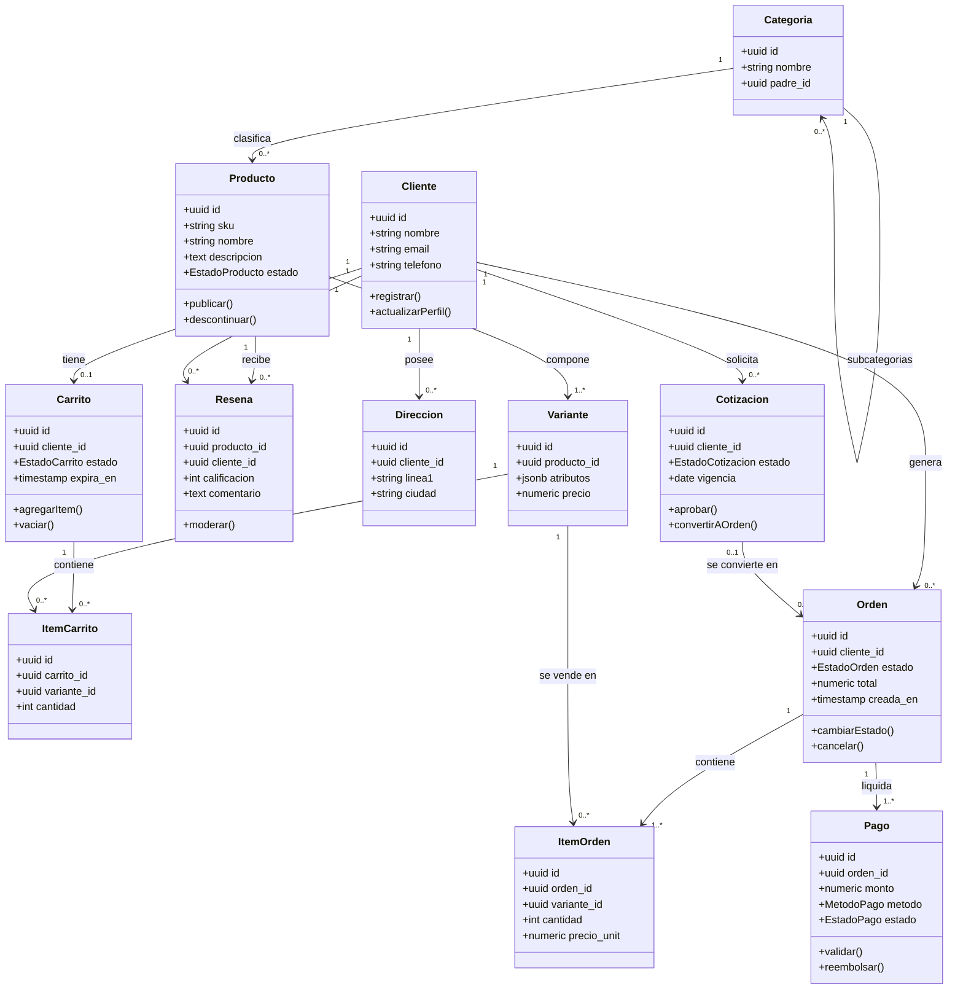
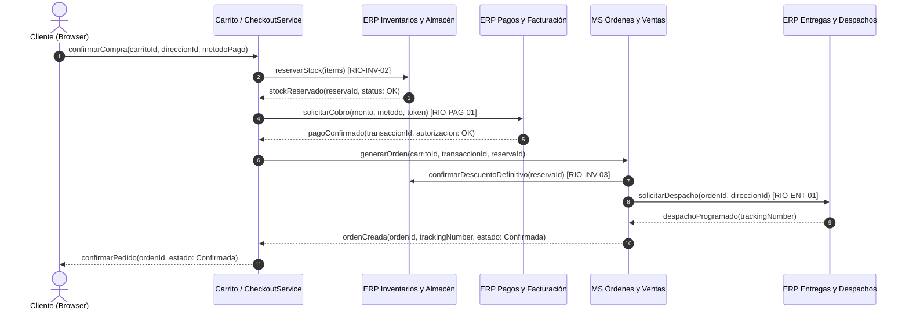
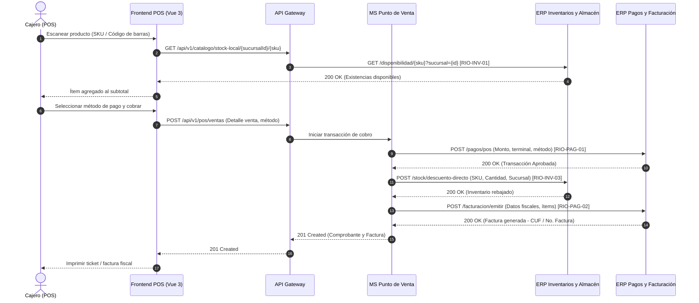
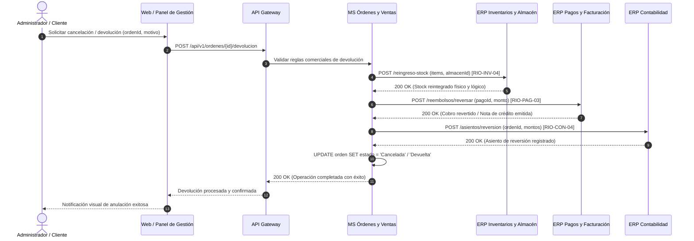
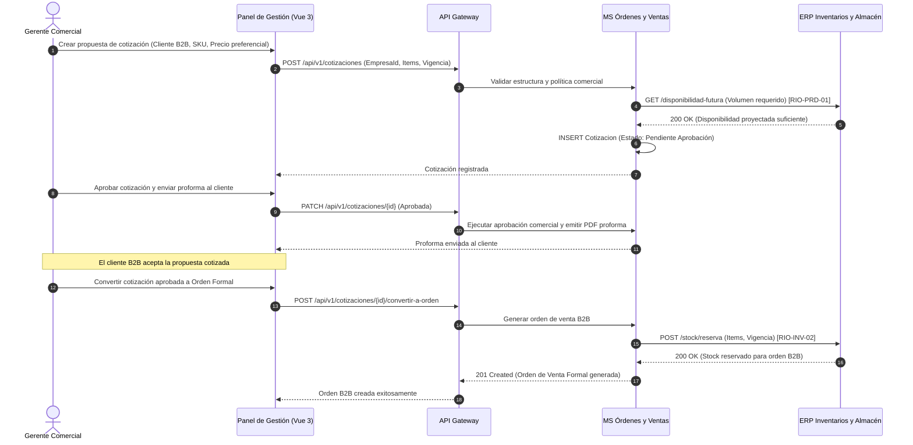

# 3. Modelo Estructural de Datos y Flujos de Información

Este documento detalla el modelo estático de datos (entidades, atributos, operaciones y asociaciones) y los diagramas de secuencia que definen el movimiento dinámico de información entre los componentes internos y los sistemas externos del ERP.

---

## 3.a Modelo Estructural de Datos Estático (Diagrama de Clases)

El modelo se organiza conceptualmente alrededor de **tres agregados principales**:
1. **Agregado Producto:** Producto, Categoría, Variante y Reseña.
2. **Agregado Cliente:** Cliente, Dirección, Carrito de Compras e Ítems de Carrito.
3. **Agregado Orden:** Orden de Venta, Ítems de Orden, Pagos y Cotizaciones B2B.

---

## 3.b Modelos de Flujo de Información (Diagramas de Secuencia)

### Flujo 1: Proceso de Compra en el Marketplace Digital
Describe la compra efectuada por un cliente a través de la tienda web/móvil, involucrando validaciones de inventario, procesamiento de cobro electrónico, generación formal de la orden y solicitud de entrega a domicilio.

---

### Flujo 2: Venta Presencial en Punto de Venta Físico (POS)
Describe la atención en caja física por un cajero, con validación de stock local de la sucursal, cobro presencial (efectivo/tarjeta) y emisión inmediata del comprobante/factura electrónica.

---

### Flujo 3: Cancelación y Devolución con Reversión Contable e Inventario
Garantiza la consistencia financiera e inventarial cuando una orden se cancela antes de su despacho o se autoriza una devolución posterior.

---

### Flujo 4: Cotizaciones Corporativas B2B
Permite a clientes empresariales solicitar cotizaciones por volumen con listas de precios preferenciales, pasando por un flujo de aprobación comercial antes de convertirse en una orden formal.

