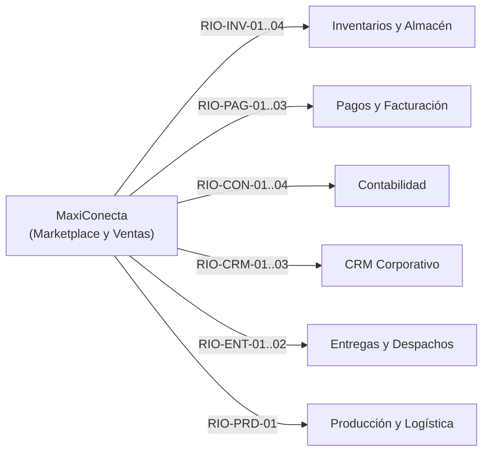

# 6. Requerimientos de Interoperabilidad con el ERP Corporativo

El sistema **MaxiConecta Marketplace y Ventas** opera como el módulo comercial de un ERP empresarial distribuido. Para garantizar la coherencia operativa y financiera, interactúa con 6 subsistemas externos a través de contratos de interoperabilidad bien definidos (identificados con el prefijo **RIO** - *Requerimiento de Interoperabilidad*).

---

## Matriz General de Interoperabilidad

---

## 1. Integración con Gestión de Inventarios y Almacén

| ID | Requerimiento de Interoperabilidad | Protocolo / Método Sugerido | Descripción Operativa |
| :--- | :--- | :--- | :--- |
| **RIO-INV-01** | Consultar disponibilidad de stock en tiempo real | `GET /api/v1/stock/{sku}?sucursal_id={id}` | Se ejecuta antes de permitir la adición al carrito o el cobro en caja física para evitar pedidos sin existencias físicas. |
| **RIO-INV-02** | Solicitar reserva temporal de existencias | `POST /api/v1/reservas-stock` | Bloquea temporalmente el stock durante el proceso de checkout digital mediante un TTL para evitar sobreventas concurrentes. |
| **RIO-INV-03** | Publicar evento de confirmación de venta | `POST /api/v1/stock/descuento-definitivo` | Al confirmarse el pago de la orden, ejecuta el descuento físico definitivo de inventario en el almacén o sucursal correspondiente. |
| **RIO-INV-04** | Notificar aprobación de devolución o cancelación | `POST /api/v1/stock/reingreso` | Informa la anulación para gestionar el reingreso físico y lógico del producto devuelto a las existencias disponibles del almacén. |

---

## 2. Integración con Gestión de Pagos y Facturación

| ID | Requerimiento de Interoperabilidad | Protocolo / Método Sugerido | Descripción Operativa |
| :--- | :--- | :--- | :--- |
| **RIO-PAG-01** | Enviar solicitud de procesamiento de cobro | `POST /api/v1/cobros/procesar` | Envía a la pasarela digital o terminal POS el monto total, moneda, método de pago y token de transacción para su liquidación. |
| **RIO-PAG-02** | Transmitir detalle fiscal de la orden | `POST /api/v1/facturas/emitir` | Envía datos fiscales (NIT/CI, razón social, detalle de ítems, precios netos e IVA) para la emisión y timbrado legal de la factura electrónica (código CUF). |
| **RIO-PAG-03** | Solicitar reversión de cobro y nota de crédito | `POST /api/v1/facturas/anulacion-o-nota-credito` | Dispara la devolución monetaria al método de pago de origen y la emisión de una nota de crédito fiscal ante cancelaciones autorizadas. |

---

## 3. Integración con Contabilidad

| ID | Requerimiento de Interoperabilidad | Protocolo / Método Sugerido | Descripción Operativa |
| :--- | :--- | :--- | :--- |
| **RIO-CON-01** | Notificar datos consolidados de ventas | `POST /api/v1/asientos/venta` | Notifica ingresos brutos, desglose de impuestos e importes por canal/forma de cobro para generar el asiento contable diario de ventas de forma automática. |
| **RIO-CON-02** | Transmitir costo unitario y total vendido | `POST /api/v1/asientos/costo-ventas` | Transmite el costo de mercadería vendida para alimentar el registro del costo de ventas contable de la empresa. |
| **RIO-CON-04** | Notificar devoluciones y cancelaciones aprobadas | `POST /api/v1/asientos/reversion` | Envía la información necesaria para que el sistema contable genere automáticamente los asientos de ajuste de costo y reversión de ingresos. |

---

## 4. Integración con CRM (Customer Relationship Management)

| ID | Requerimiento de Interoperabilidad | Protocolo / Método Sugerido | Descripción Operativa |
| :--- | :--- | :--- | :--- |
| **RIO-CRM-01** | Sincronizar datos del perfil de cliente | `POST /api/v1/clientes/sync` | Sincroniza nombres, correos, teléfonos y direcciones registradas o actualizadas en el módulo de ventas con la base de datos central del CRM. |
| **RIO-CRM-02** | Notificar cada evento de compra confirmada | `POST /api/v1/clientes/{id}/eventos-compra` | Transmite monto, ticket, frecuencia y categorías adquiridas para enriquecer el perfil de cliente y mantener actualizada su segmentación (RFM). |
| **RIO-CRM-03** | Comunicar valor consumido para programa de fidelidad | `POST /api/v1/fidelidad/acumular-canjear` | Notifica el importe elegible de la compra para sumar puntos o informa el canje de puntos utilizados como descuento en el checkout. |

---

## 5. Integración con Gestión de Entregas y Despachos

| ID | Requerimiento de Interoperabilidad | Protocolo / Método Sugerido | Descripción Operativa |
| :--- | :--- | :--- | :--- |
| **RIO-ENT-01** | Notificar orden con modalidad "envío a domicilio" | `POST /api/v1/despachos/solicitar` | Envía el identificador de orden, ítems, dimensiones/peso y coordenadas o dirección de entrega para la asignación de transportista y hoja de ruta. |
| **RIO-ENT-02** | Consumir estados de transporte en tiempo real | `GET /api/v1/despachos/{tracking_id}/estado` | Consulta o recibe mediante webhook los cambios de estado del envío (*En preparación, En tránsito, En camino, Entregado*) para mostrar al cliente. |

---

## 6. Integración con Producción y Logística

| ID | Requerimiento de Interoperabilidad | Protocolo / Método Sugerido | Descripción Operativa |
| :--- | :--- | :--- | :--- |
| **RIO-PRD-01** | Consultar disponibilidad y fechas estimadas | `GET /api/v1/produccion/proyeccion-stock/{sku}` | Permite a los módulos de Catálogo y Cotizaciones B2B conocer fechas previstas de terminación de lotes de producción y reabastecimiento interno. |
