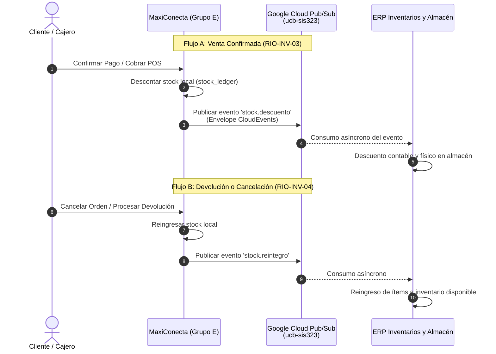

# 11. Contrato de API y Eventos con ERP de Inventarios — Google Cloud Pub/Sub (US-40 / RF-40 / KAN-56)

**Materia:** UCB SIS-323 — Taller de Sistemas  
**Grupo:** Grupo E — Marketplace y Ventas (*MaxiConecta*)  
**Responsable:** Kevin Sancalli  
**Historia de Usuario Padre:** `KAN-14` / `KAN-56`  
**Requerimiento Funcional:** `RF-40` — Integración con Inventarios y Almacén  
**Subtareas:** `KAN-256` (Documentación del contrato), `KAN-267` (Diseño del contrato de eventos), `KAN-278` (Pruebas de integración), `KAN-284` (Backend publicador/consumidor).

---

## 1. Contexto y Objetivos de la Integración

El sistema **MaxiConecta** actúa como el front-office y canal omnicanal de comercialización (Marketplace digital y Punto de Venta físico POS). Para garantizar que las existencias físicas se mantengan cuadradas y no ocurran sobreventas ni discrepancias entre los almacenes y los canales comerciales, se implementa una arquitectura orientada a eventos (*Event-Driven Architecture*) apoyada en **Google Cloud Pub/Sub** y APIs REST síncronas de fallback.



---

## 2. Infraestructura Google Cloud Pub/Sub

- **Proyecto GCP:** `project-a96e5fe1-5ba6-4698-a85`
- **Tópico Principal:** `projects/project-a96e5fe1-5ba6-4698-a85/topics/ucb-sis323`
- **Credenciales:** Service Account IAM `sis323@project-a96e5fe1-5ba6-4698-a85.iam.gserviceaccount.com` (RSA-2048, OAuth2 scope `https://www.googleapis.com/auth/pubsub`).
- **Codificación:** Mensajes en formato JSON codificados en `UTF-8`.

---

## 3. KAN-267: Diseño del Contrato de Eventos (Event Envelope)

Para garantizar interoperabilidad estandarizada con los sistemas de otros grupos, los eventos se envían bajo el estándar **CloudEvents v1.0** extendido con atributos de ruteo en el encabezado.

### 3.1. Atributos del Mensaje Pub/Sub (Message Attributes)

| Atributo | Tipo | Descripción | Ejemplo |
| :--- | :--- | :--- | :--- |
| `grupo` | `string` | Identificador del equipo emisor | `"Grupo-E"` |
| `modulo` | `string` | Módulo específico del sistema | `"Marketplace-and-Sales"` |
| `tipo_evento` | `string` | Tipo taxonómico del evento | `"stock.descuento"` \| `"stock.reintegro"` \| `"prueba_docente"` |
| `correlation_id` | `string` | ID de trazabilidad extremo a extremo | `"ORD-A81B3C"` \| `"POS-09F21A"` |
| `timestamp` | `string` | Fecha/hora UTC en formato ISO-8601 | `"2026-10-10T17:50:58.443Z"` |

---

### 3.2. Catálogo de Eventos

#### Evento 1: `stock.descuento` (Requerimiento RIO-INV-03)
Emitido cuando una orden en el Marketplace es pagada satisfactoriamente o cuando se finaliza una venta presencial en el POS.

```json
{
  "specversion": "1.0",
  "event_id": "evt-7f89d3a2b1c4",
  "event_type": "stock.descuento",
  "source": "maxiconecta.marketplace.grupo-e",
  "timestamp": "2026-10-10T17:52:32.941Z",
  "correlation_id": "ORD-5E7291A",
  "equipo": "Grupo E — Marketplace y Ventas",
  "materia": "UCB SIS-323",
  "payload": {
    "tipo_movimiento": "DESCUENTO_DEFINITIVO",
    "orden_id": "ORD-5E7291A",
    "origen": "marketplace",
    "sucursal_id": "SUC-LP-CENTRAL",
    "almacen_id": "ALM-CENTRAL-01",
    "reserva_id": "RES-MOCK-39A2BF",
    "items": [
      {
        "sku": "PAR-TRA-105-STD",
        "cantidad": 2,
        "nombre": "Paracetamol 500mg - Frasco x 100",
        "precio_unitario": 35.50
      },
      {
        "sku": "IBU-GEN-020-STD",
        "cantidad": 1,
        "nombre": "Ibuprofeno 400mg x 20",
        "precio_unitario": 22.00
      }
    ],
    "usuario_responsable": "cliente-web"
  }
}
```

#### Evento 2: `stock.reintegro` (Requerimiento RIO-INV-04)
Emitido cuando una orden es cancelada antes del despacho o cuando se autoriza una devolución física de mercadería.

```json
{
  "specversion": "1.0",
  "event_id": "evt-4b12c8e0f9a3",
  "event_type": "stock.reintegro",
  "source": "maxiconecta.marketplace.grupo-e",
  "timestamp": "2026-10-10T17:54:10.112Z",
  "correlation_id": "ORD-5E7291A",
  "equipo": "Grupo E — Marketplace y Ventas",
  "materia": "UCB SIS-323",
  "payload": {
    "tipo_movimiento": "REINTEGRO_DEVOLUCION",
    "orden_id": "ORD-5E7291A",
    "motivo": "cancelacion_cliente_tiempo_limite",
    "origen": "marketplace",
    "sucursal_id": "SUC-LP-CENTRAL",
    "items": [
      {
        "sku": "PAR-TRA-105-STD",
        "cantidad": 2,
        "nombre": "Paracetamol 500mg - Frasco x 100"
      }
    ]
  }
}
```

#### Evento 3: `prueba_docente` / `prueba_conexion` (Tarea Cátedra SIS-323)
Evento emitido para verificar la conectividad de los grupos al bus unificado.

```json
{
  "specversion": "1.0",
  "event_id": "evt-docente-init-20261010",
  "event_type": "prueba_docente",
  "source": "maxiconecta.marketplace.grupo-e",
  "timestamp": "2026-10-10T17:50:58.443Z",
  "correlation_id": "DOCENTE-TEST-01",
  "equipo": "Grupo E — Marketplace y Ventas",
  "materia": "UCB SIS-323",
  "payload": {
    "evento": "PRUEBA_PUBLICACION_DOCENTE",
    "equipo": "Grupo E — Marketplace y Ventas",
    "responsable": "Kevin Sancalli",
    "materia": "UCB SIS-323",
    "descripcion": "Prueba de publicacion de mensaje a Google Cloud Pub/Sub para confirmacion de recepcion docente",
    "fecha_hora_utc": "2026-10-10T17:50:58.443Z",
    "fecha_hora_bolivia": "10/10/2026, 1:50:58 p. m."
  }
}
```

---

## 4. KAN-256: Contrato de API REST Complementario

Para entornos de testing o contingencia cuando Pub/Sub opera en modo síncrono, se documentan los endpoints HTTP expuestos en los microservicios:

### 4.1. `POST /api/v1/stock/descuento-definitivo`
- **Finalidad:** Ejecuta el descuento de stock tras la confirmación del pago.
- **Request Body:**
  ```json
  {
    "reserva_id": "RES-MOCK-XXXXXX",
    "orden_id": "ORD-12345",
    "items": [
      { "sku": "PAR-TRA-105-STD", "cantidad": 2 }
    ]
  }
  ```
- **Response `200 OK`:**
  ```json
  {
    "status": "DESCONTADO",
    "modo": "pubsub_online",
    "message_id": "21554884647235182"
  }
  ```

### 4.2. `POST /api/v1/stock/reingreso`
- **Finalidad:** Reintegra mercadería de órdenes canceladas o devueltas.
- **Request Body:**
  ```json
  {
    "orden_id": "ORD-12345",
    "motivo": "cancelacion_orden",
    "items": [
      { "sku": "PAR-TRA-105-STD", "cantidad": 2 }
    ]
  }
  ```
- **Response `200 OK`:**
  ```json
  {
    "status": "REINGRESADO",
    "modo": "pubsub_online",
    "message_id": "21554899120348123"
  }
  ```

### 4.3. `POST /api/v1/inventario/eventos/publicar-test`
- **Finalidad:** Endpoint para administradores para lanzar una prueba manual a Google Pub/Sub.
- **Response `200 OK`:**
  ```json
  {
    "success": true,
    "messageId": "21554884647235182",
    "topic": "projects/project-a96e5fe1-5ba6-4698-a85/topics/ucb-sis323",
    "timestamp": "2026-10-10T17:50:58.443Z"
  }
  ```

---

## 5. Idempotencia, Reintentos y Resiliencia

1. **Deduplicación:** Todo suscriptor en el ERP de Inventarios debe usar la clave `event_id` o la tupla `(orden_id, tipo_movimiento)` para ignorar reentregas garantizadas por la semántica *at-least-once* de Google Pub/Sub.
2. **Fallback Offline Transparente:** Si la conexión a Google Cloud Pub/Sub experimenta intermitencia o latencia superior a 10s:
   - MaxiConecta efectúa el descuento en el libro local de existencias (`stock_ledger`).
   - El evento se registra en la cola de auditoría offline con estado `FALLBACK_OFFLINE`.
   - Se evita bloquear la venta del cliente en el checkout o en la caja física POS.

---

## 6. Registro de Pruebas de Publicación Reales

- **ID de Mensaje Inicial:** `21554884647235182`
- **Timestamp de Envío:** `2026-10-10T17:50:58.443Z` (Hora Bolivia: `10/10/2026, 1:50:58 p. m.`)
- **Tópico Destino:** `projects/project-a96e5fe1-5ba6-4698-a85/topics/ucb-sis323`
- **Estado:** Entregado con éxito a la infraestructura de Google Cloud.
